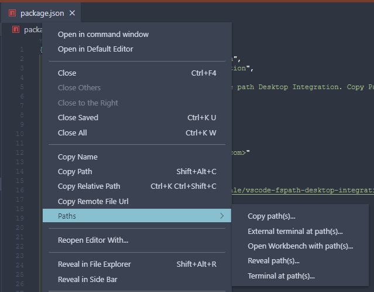

# vscode-fspath-desktop-integration README

Various commands for file path that integrate with the OS Desktop.

## Features



It supports the following commands in the explorer context menus:

* Copy Name

It supports the following commands in the editor title and editor context menus:

* Copy Name
* Copy Relative Path


It supports the following commands in the ```Path`` submenu in explorer, editor title and editor context menus:

* Copy paths...
* External terminal at paths...
* Open Workbench for paths...
* Reopen Workbench for paths...
* Reveal paths...
* Terminal at paths...

The commands show a menu of paths associated with the path of selected item. Once selected the respect1ive command on the selected path.

## Known Issues

No known issues.

## Release Notes

### 1.0.12
